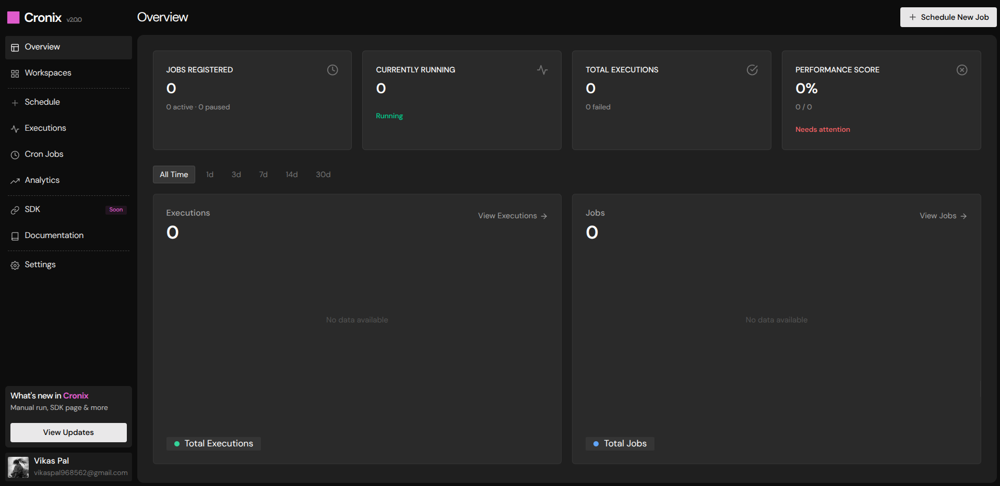

<div align="center">

<a href="https://github.com/vikas-x7/cronix">
  <svg width="44" height="44" viewBox="0 0 24 24" xmlns="http://www.w3.org/2000/svg" aria-label="Cronix logo">
    <rect width="20" height="20" x="2" y="2" rx="3" fill="#DF5BCC"/>
  </svg>
</a>

# Cronix

**A self-hosted cron job and event automation platform schedule, trigger, and monitor HTTP jobs with ease.**

[](https://nextjs.org)
[](https://nestjs.com)
[](https://www.typescriptlang.org)
[](https://react.dev)
[](https://www.prisma.io)
[](https://tailwindcss.com)
[](https://redis.io)
[](https://www.postgresql.org)
[](https://docs.bullmq.io)
[](#license)

</div>

---

<div align="center">



</div>

---

## About the Project

**Cronix** is a self-hosted automation platform for scheduling and monitoring HTTP requests via cron jobs or webhook triggers. Built as a Turborepo monorepo with a Next.js frontend and NestJS backend, it provides a clean dashboard to manage workspaces, configure jobs, track execution history, and receive failure notifications via email.

Designed for **developers and DevOps** who need a lightweight, self-hostable services .

## Features

- **Cron-based scheduling** with validated cron expressions and quick presets (minute, hourly, daily, weekly, monthly).
- **Webhook-triggered jobs** with unique tokens and URLs for on-demand execution.
- **Workspace organization** - group jobs into workspaces with per-user ownership isolation.
- **Execution tracking** with detailed logs, HTTP status codes, duration, retry attempts, and trigger types.
- **Dashboard & analytics** - total/active/paused job counts, 24-hour success rate, upcoming jobs, and recent executions.
- **Email notifications** on job failure via Resend, configurable per job.
- **OAuth authentication** - login with Google or GitHub (JWT access + refresh tokens in httpOnly cookies).
- **Rate limiting & security** - Helmet.js headers, CORS, Redis-backed rate limiting, input validation.
- **Automatic cleanup** - nightly purge of old logs (7 days) and executions (30 days).

## Tech Stack

### Monorepo

| Layer           | Technology                                                  |
| --------------- | ----------------------------------------------------------- |
| Monorepo Tool   | [Turborepo](https://turbo.build)                            |
| Package Manager | [pnpm](https://pnpm.io) (workspaces)                        |
| Language        | [TypeScript 5](https://www.typescriptlang.org) (throughout) |

### Frontend (`apps/web`)

| Layer            | Technology                                                                                   |
| ---------------- | -------------------------------------------------------------------------------------------- |
| Framework        | [Next.js 16](https://nextjs.org) (App Router)                                                |
| UI               | [React 19](https://react.dev) · [Tailwind CSS 4](https://tailwindcss.com)                    |
| State Management | [Zustand](https://zustand-demo.pmnd.rs) · [TanStack React Query](https://tanstack.com/query) |
| Forms            | [React Hook Form](https://react-hook-form.com) + [Zod](https://zod.dev)                      |
| Animations       | [Framer Motion](https://www.framer.com/motion)                                               |
| HTTP Client      | [Axios](https://axios-http.com) (with auto token refresh)                                    |

### Backend (`apps/server`)

| Layer              | Technology                                                                                                |
| ------------------ | --------------------------------------------------------------------------------------------------------- |
| Framework          | [NestJS 11](https://nestjs.com) (Express)                                                                 |
| ORM                | [Prisma 7](https://www.prisma.io) (PostgreSQL)                                                            |
| Queue / Jobs       | [BullMQ 5](https://docs.bullmq.io) (Redis-backed)                                                         |
| Cache / Rate Limit | [Redis 7](https://redis.io) via [ioredis](https://github.com/redis/ioredis)                               |
| Authentication     | [Passport.js](http://www.passportjs.org) (JWT, Google OAuth, GitHub OAuth)                                |
| Email              | [Resend](https://resend.com)                                                                              |
| Security           | [Helmet](https://helmetjs.github.io) · [NestJS Throttler](https://docs.nestjs.com/security/rate-limiting) |

### Database & Queue

| Layer     | Technology                                                        |
| --------- | ----------------------------------------------------------------- |
| Database  | [PostgreSQL 16](https://www.postgresql.org)                       |
| ORM       | [Prisma 7](https://www.prisma.io)                                 |
| Queue     | [BullMQ 5](https://docs.bullmq.io) on [Redis 7](https://redis.io) |
| In-Memory | [Redis 7](https://redis.io) (rate limiting, session cache)        |

## Getting Started

### Prerequisites

- **Node.js** 20+
- **PostgreSQL** running locally or remotely
- **Redis** running locally or remotely (Upstash recommended)
- **pnpm** 9+

### Installation

```bash
# 1. Clone the repository
git clone https://github.com/your-username/cronix.git
cd cronix

# 2. Install dependencies
pnpm install

# 3. Set up environment variables
cp apps/server/example.env apps/server/.env
cp packages/database/.env.example packages/database/.env
# Edit the .env files with your configuration

# 4. Generate Prisma client
pnpm --filter database db:generate

# 5. Apply database migrations
pnpm --filter database db:migrate

# 6. Start all apps in development mode
pnpm dev
```

The frontend runs on [http://localhost:3000](http://localhost:3000) and the API on [http://localhost:3001](http://localhost:3001).

### Environment Variables

#### Server (`apps/server/.env`)

| Variable                 | Required | Description                                                   |
| ------------------------ | -------- | ------------------------------------------------------------- |
| `NODE_ENV`               | No       | `development`, `production`, or `test`                        |
| `PORT`                   | No       | Server port (default: `3001`)                                 |
| `ALLOWED_ORIGINS`        | **Yes**  | Comma-separated CORS origins                                  |
| `FRONTEND_URL`           | No       | Frontend URL for redirects (default: `http://localhost:3000`) |
| `JWT_SECRET`             | **Yes**  | Min 32 chars, JWT signing key                                 |
| `JWT_EXPIRES_IN`         | No       | Access token expiry (default: `15m`)                          |
| `REFRESH_TOKEN_SECRET`   | **Yes**  | Min 32 chars, refresh token signing key                       |
| `JWT_REFRESH_EXPIRES_IN` | No       | Refresh token expiry (default: `7d`)                          |
| `GOOGLE_CLIENT_ID`       | **Yes**  | Google OAuth client ID                                        |
| `GOOGLE_CLIENT_SECRET`   | **Yes**  | Google OAuth client secret                                    |
| `GOOGLE_CALLBACK_URL`    | No       | Google OAuth callback (has default)                           |
| `GITHUB_CLIENT_ID`       | **Yes**  | GitHub OAuth client ID                                        |
| `GITHUB_CLIENT_SECRET`   | **Yes**  | GitHub OAuth client secret                                    |
| `GITHUB_CALLBACK_URL`    | No       | GitHub OAuth callback (has default)                           |
| `DATABASE_URL`           | **Yes**  | PostgreSQL connection string (Prisma)                         |
| `REDIS_URL`              | No       | Full Redis URL (`redis://...` or `rediss://...`)              |
| `REDIS_HOST`             | No       | Redis host (fallback if no `REDIS_URL`)                       |
| `REDIS_PORT`             | No       | Redis port (fallback if no `REDIS_URL`)                       |
| `UPSTASH_REDIS_HOST`     | No       | Upstash Redis host (alternative to above)                     |
| `UPSTASH_REDIS_TOKEN`    | No       | Upstash Redis token                                           |
| `RESEND_API_KEY`         | **Yes**  | Resend API key for failure notifications                      |
| `FROM_EMAIL`             | No       | Sender email (default: `Cronix <onboarding@resend.dev>`)      |

#### Database (`packages/database/.env`)

| Variable                           | Required | Description                                |
| ---------------------------------- | -------- | ------------------------------------------ |
| `DATABASE_URL`                     | **Yes**  | PostgreSQL connection string               |
| `DATABASE_POOL_MIN`                | No       | Min pool connections (default: `0`)        |
| `DATABASE_POOL_MAX`                | No       | Max pool connections (default: `10`)       |
| `DATABASE_IDLE_TIMEOUT_MS`         | No       | Idle connection timeout (default: `30000`) |
| `DATABASE_CONNECTION_TIMEOUT_MS`   | No       | Connection timeout (default: `10000`)      |
| `DATABASE_STATEMENT_TIMEOUT_MS`    | No       | Statement timeout (default: `30000`)       |
| `DATABASE_QUERY_TIMEOUT_MS`        | No       | Query timeout (default: `30000`)           |
| `DATABASE_TRANSACTION_MAX_WAIT_MS` | No       | Max transaction wait (default: `5000`)     |
| `DATABASE_TRANSACTION_TIMEOUT_MS`  | No       | Transaction timeout (default: `10000`)     |
| `DATABASE_LOG_QUERIES`             | No       | Enable query logging (default: `false`)    |

#### Frontend (`apps/web/.env`)

| Variable              | Required | Description                                            |
| --------------------- | -------- | ------------------------------------------------------ |
| `NEXT_PUBLIC_API_URL` | **Yes**  | Backend API URL (e.g., `http://localhost:3001/api/v1`) |

See [example.env](apps/server/example.env) and [.env.example](packages/database/.env.example) as templates.

## Available Scripts

### Root (via Turborepo)

| Script             | Description                        |
| ------------------ | ---------------------------------- |
| `pnpm dev`         | Start all apps in development mode |
| `pnpm build`       | Build all apps and packages        |
| `pnpm lint`        | Lint all apps and packages         |
| `pnpm format`      | Format code with Prettier          |
| `pnpm check-types` | Type-check all apps and packages   |

### Frontend (`apps/web`)

| Script       | Description                           |
| ------------ | ------------------------------------- |
| `pnpm dev`   | Start Next.js dev server on port 3000 |
| `pnpm build` | Build Next.js production bundle       |
| `pnpm start` | Start production server               |
| `pnpm lint`  | Run ESLint                            |

### Backend (`apps/server`)

| Script          | Description                             |
| --------------- | --------------------------------------- |
| `pnpm dev`      | Start NestJS dev server with watch mode |
| `pnpm build`    | Build for production                    |
| `pnpm start`    | Start production server                 |
| `pnpm test`     | Run unit tests                          |
| `pnpm test:e2e` | Run end-to-end tests                    |
| `pnpm lint`     | Run ESLint with auto-fix                |

### Database (`packages/database`)

| Script                   | Description                        |
| ------------------------ | ---------------------------------- |
| `pnpm db:generate`       | Generate Prisma client from schema |
| `pnpm db:migrate`        | Create and apply dev migrations    |
| `pnpm db:migrate:deploy` | Apply migrations in production     |
| `pnpm db:push`           | Push schema without migrations     |
| `pnpm db:studio`         | Open Prisma Studio GUI             |
| `pnpm db:seed`           | Run seed script                    |

## Deployment

The application is designed to be deployed as two separate services (frontend + backend) with a shared PostgreSQL and Redis instance.

1. Provision a **PostgreSQL** database (Neon, Supabase, Railway, etc.).
2. Provision a **Redis** instance (Upstash recommended for serverless).
3. Configure all environment variables for production.
4. Run `pnpm --filter database db:migrate:deploy` to apply migrations.
5. Build and deploy the backend (`apps/server`) and frontend (`apps/web`) separately.

## Contributing

We welcome contributions! Please see our [Contributing Guide](.github/CONTRIBUTING.md) for details.

## Code of Conduct

This project follows the [Contributor Covenant Code of Conduct](.github/CODE_OF_CONDUCT.md). By participating, you are expected to uphold this code.

## Security

Please see our [Security Policy](.github/SECURITY.md) for reporting vulnerabilities.

## License

This project is licensed under the MIT License - see the [LICENSE](LICENSE) file for details.

---

<div align="center">

</div>
